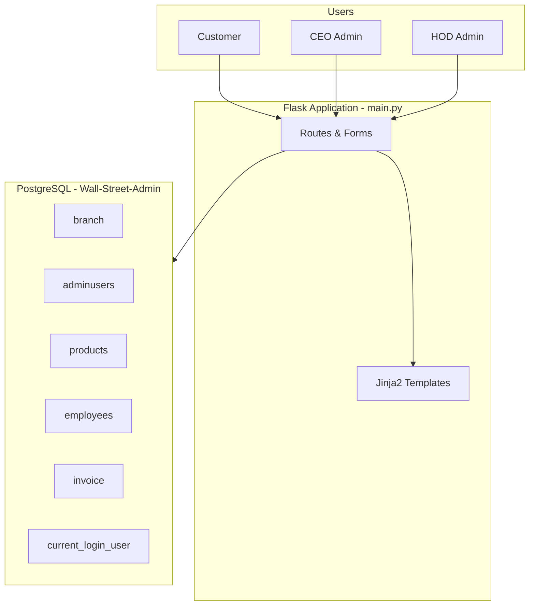

# WallStreets — Real Estate Management System (Flask + PostgreSQL)

**WallStreets** is an open-source **real estate property management web application** built with **Python Flask** and **PostgreSQL**. It helps agencies manage **property listings** (plots, houses, shops, malls), **multi-branch operations**, **customer accounts**, **employee payroll**, and **branch invoices** through role-based dashboards for **CEO**, **Head of Department (HOD)**, and **customers**.

> Ideal for learning **full-stack real estate software**, **database-driven admin panels**, and **PostgreSQL stored procedures** in a university or portfolio project.

[](https://www.python.org/)
[](https://flask.palletsprojects.com/)
[](https://www.postgresql.org/)
[]()

---

## Table of Contents

- [Features](#features)
- [Tech Stack](#tech-stack)
- [Architecture Overview](#architecture-overview)
- [Project Structure](#project-structure)
- [Prerequisites](#prerequisites)
- [Installation](#installation)
- [Database Setup](#database-setup)
- [Running the Application](#running-the-application)
- [User Roles & Workflows](#user-roles--workflows)
- [API Routes](#api-routes)
- [Sample Data](#sample-data)
- [Contributing](#contributing)
- [Authors](#authors)
- [Keywords](#keywords)

---

## Features

### Customer portal
- User **registration** and **sign-in**
- Browse **property listings** (rent / sale)
- View products uploaded by branch admins

### CEO dashboard
- **Upload properties** — category, price, type (rent/sale), location, address, size, description
- **Register HOD** (Head of Department) users per branch
- **Open new branches** (branch code + city)
- **Manage invoices** — record branch income and expenses
- **Add employees** and run **salary payout** (`PaySal` procedure)
- **Delete HOD** accounts (with CEO protection)

### HOD dashboard
- Upload and manage **property listings** for assigned branch
- **Invoice management** for branch finances
- **Employee registration** for the branch

### Database layer (PostgreSQL)
- Tables: `branch`, `adminusers`, `customers`, `products`, `employees`, `invoice`, `current_login_user`
- **PL/pgSQL functions**: `GET_PASS`, `GET_type`, `GET_customers_PASS`, `add_products`, `CHECK_PASS`
- **Stored procedures**: `add_invoice`, `paysal`, `update_current_user`
- **Views**: `current_invoice` (branch-scoped invoice view)
- **Triggers**: `move_del` — backup admin data on HOD deletion

---

## Tech Stack

| Layer | Technology |
|--------|------------|
| Backend | [Flask](https://flask.palletsprojects.com/) (Python) |
| Database | [PostgreSQL](https://www.postgresql.org/) |
| DB driver | [psycopg2](https://www.psycopg.org/) |
| ORM (imported) | Flask-SQLAlchemy |
| Frontend | HTML5, Jinja2 templates, CSS |
| Icons | Font Awesome (`public/fonts/`) |

---

## Architecture Overview



---

## Project Structure

```
WallStreets---Real-Estate-Managing-App/
├── main.py                 # Flask app entry point & all routes
├── adminusrquries.sql      # Full schema, functions, procedures, seed data
├── sqlquries.sql           # Core admin user table & functions
├── templates/              # HTML views (Jinja2)
│   ├── index.html          # Sign-in / sign-up
│   ├── ceo.html            # CEO dashboard
│   ├── hod.html            # HOD dashboard
│   ├── custumer.html       # Customer home
│   ├── upload_products.html
│   ├── display_products.html
│   ├── manage_invoices.html
│   ├── invoices.html
│   ├── register_hod.html
│   ├── register_employee.html
│   ├── open_branch.html
│   └── style.css
├── public/fonts/           # Font Awesome assets
└── .vscode/                # Editor configuration
```

---

## Prerequisites

- **Python 3.8+**
- **PostgreSQL 12+** installed and running locally
- `pip` (Python package manager)
- Git (optional, for cloning)

---

## Installation

### 1. Clone the repository

```bash
git clone https://github.com/danishjavedcodes/WallStreets---Real-Estate-Managing-App.git
cd WallStreets---Real-Estate-Managing-App
```

### 2. Create a virtual environment (recommended)

```bash
python3 -m venv venv
source venv/bin/activate   # macOS / Linux
# venv\Scripts\activate    # Windows
```

### 3. Install Python dependencies

```bash
pip install flask flask-sqlalchemy psycopg2-binary
```

---

## Database Setup

### 1. Create the PostgreSQL database

```sql
CREATE DATABASE "Wall-Street-Admin";
```

### 2. Run SQL scripts

Execute the schema and logic in order:

1. **`adminusrquries.sql`** — uncomment and run the full schema (tables, functions, procedures, views, triggers, and optional seed data).
2. **`sqlquries.sql`** — additional admin user definitions if needed.

> The Flask app connects using the settings in `main.py`. Update credentials for your environment before production use.

### 3. Default connection settings (`main.py`)

| Setting | Default |
|---------|---------|
| Database | `Wall-Street-Admin` |
| User | `postgres` |
| Password | `sys` |
| Host | `localhost` |
| Port | `5432` |

**Security note:** Do not commit real passwords. Use environment variables or a `.env` file (excluded from Git) for production deployments.

---

## Running the Application

```bash
python main.py
```

Open your browser at:

**http://127.0.0.1:5000/**

- **Customers:** sign up or sign in on the home page  
- **Admins:** use **Sign in admin** for CEO or HOD access  

---

## User Roles & Workflows

| Role | Access |
|------|--------|
| **Customer** | Register → Sign in → View property listings |
| **CEO** | Full control: branches, HODs, products, employees, invoices, payroll |
| **HOD** | Branch-level: products, invoices, employees |

### Typical CEO workflow
1. Open a **new branch** (city + branch code).
2. **Register HOD** for that branch.
3. **Add employees** with salary and branch assignment.
4. **Upload properties** (plot, house, shop, mall — rent or sale).
5. Record **invoices** and process **salary payments**.

---

## API Routes

| Route | Method | Description |
|-------|--------|-------------|
| `/` | GET, POST | Home — customer sign-in / sign-up |
| `/signupuser` | POST | Customer registration |
| `/signin` | POST | Customer login |
| `/signinadmin` | POST | Admin login (CEO / HOD) |
| `/registerHOD` | GET | HOD registration page |
| `/signup_hod` | POST | Create HOD user |
| `/open_branch` | POST | Create new branch |
| `/add_products` | POST | Add property listing |
| `/display_products` | GET | List all properties |
| `/invoice` | POST | Add branch invoice |
| `/PaySal` | GET | Pay salaries via stored procedure |
| `/add_emp` | POST | Add employee |
| `/delete_hod` | POST | Remove HOD (CEO protected) |
| `/invoices` | GET | View current branch invoices |

---

## Sample Data

The repository includes commented **seed data** in `adminusrquries.sql` for Pakistani cities (Islamabad, Lahore, Karachi, Kharian), for example:

- Shops, plots, houses, and malls for **rent** and **sale**
- Sample **customers**, **employees**, and **invoices**

Uncomment the `INSERT` blocks in `adminusrquries.sql` to load demo data for testing.

---

## Contributing

Contributions are welcome.

1. Fork the repository  
2. Create a feature branch: `git checkout -b feature/your-feature`  
3. Commit your changes with a clear message  
4. Push and open a Pull Request  

Please keep SQL migrations documented and avoid committing database passwords.

---

## Authors

This project was developed as a collaborative **real estate management system** coursework / team effort, including contributions from:

- **Danish Javed** — schema, customer auth, products, invoices, current user session  
- **Ali** — products table design  
- **Shurahbeel** — backup triggers, employee payroll procedures  

Maintainer repository: [danishjavedcodes/WallStreets---Real-Estate-Managing-App](https://github.com/danishjavedcodes/WallStreets---Real-Estate-Managing-App)

---

## Keywords

`real estate management system` · `property management software` · `Flask real estate app` · `PostgreSQL property database` · `real estate admin panel` · `branch management system` · `property listing CRUD` · `invoice management` · `employee payroll` · `CEO HOD dashboard` · `open source real estate` · `Python web app` · `Wall Streets real estate`

---

## Star this repo

If this project helped you learn **Flask**, **PostgreSQL**, or **real estate web development**, consider giving it a ⭐ on GitHub.
